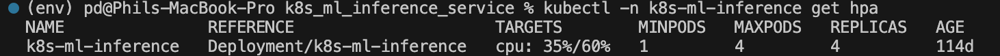
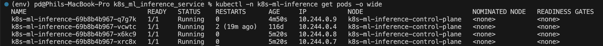
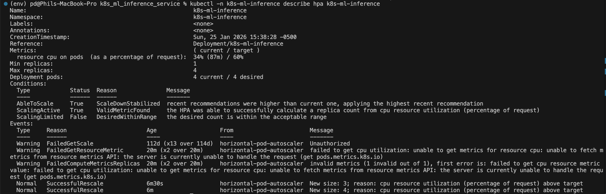
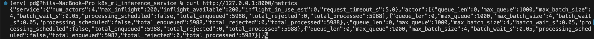

# Kubernetes-Deployed ML Inference Service


[](https://github.com/philzd/k8s-ml-inference-service/actions/workflows/ci.yml)

A containerized ML inference service built with FastAPI and Ray, deployed locally on Kubernetes (kind) with batching, backpressure, autoscaling, health checks, and operational metrics.

---

## TL;DR

This project implements a scalable ML inference service designed to simulate production-style serving infrastructure.

```text
Client requests
↓
FastAPI service
↓
Concurrency limits
↓
Ray actors
(batching + queue limits)
↓
Kubernetes deployment
(HPA + health probes)
↓
Autoscaled inference service
```

The goal is to demonstrate operational ML infrastructure patterns including concurrent request handling, batching, overload protection, autoscaling, and Kubernetes deployment.

---

## Overview

This project demonstrates a lightweight but production-style ML serving workflow:

- Containerized FastAPI inference service
- Distributed request execution using Ray actors
- Micro-batching for throughput optimization
- Explicit backpressure and overload protection
- Kubernetes deployment using kind
- Horizontal Pod Autoscaling (HPA)
- Readiness and liveness health checks
- Runtime resource monitoring

The system is intentionally focused on operational infrastructure patterns rather than model complexity.

---

## What This Project Demonstrates

- Concurrent ML request handling with FastAPI
- Distributed execution using Ray actors
- Micro-batching for throughput optimization
- Explicit backpressure and overload protection
- Kubernetes deployment and health management
- Horizontal Pod Autoscaling (HPA)
- Operational observability and runtime metrics

---

## System Architecture

```text
Client requests
↓
FastAPI service
↓
Concurrency limits
↓
Ray actors
(batching + queue limits)
↓
Kubernetes pods
(HPA + health probes)
↓
Autoscaled inference service
```

---

## Core Features

### Concurrent Request Handling

FastAPI handles incoming inference requests asynchronously while limiting concurrent inflight requests to maintain stability under load.

### Distributed Execution with Ray

Inference work is distributed across multiple Ray actors to simulate scalable execution workers.

Each actor processes requests independently.

### Micro-Batching

Ray actors batch requests over a short time window before processing.

Benefits:

- Improved throughput
- Reduced scheduling overhead
- More stable request handling under bursty traffic

### Backpressure Protection

The service implements layered overload protection:

- Global inflight semaphore limits concurrent requests
- Each Ray actor maintains a bounded internal queue
- Requests exceeding limits are rejected instead of allowing unbounded queue growth

This stabilizes latency and protects the service during traffic spikes.

### Kubernetes Deployment

The application is containerized with Docker and deployed locally to Kubernetes using kind.

Kubernetes resources include:

- Namespace
- Deployment
- Service
- Horizontal Pod Autoscaler (HPA)

### Health Checks

The deployment includes:

- Readiness probes
- Liveness probes

These ensure unhealthy pods are automatically restarted and traffic is only routed to healthy instances.

### Horizontal Pod Autoscaling

The HPA automatically scales pod replicas based on CPU utilization.

The deployment was validated under synthetic load to demonstrate:

- Scale-up under increased traffic
- Scale-down after traffic decreases

### Observability

Runtime metrics and operational behavior were monitored using:

- `kubectl top pods`
- `kubectl describe hpa`
- `kubectl get pods -w`

This enables visibility into:

- CPU utilization
- Replica scaling behavior
- Pod lifecycle events

---

## Operational Validation

The service was subjected to synthetic concurrent load to verify autoscaling behavior, queue stability, and pod lifecycle management under bursty traffic.

### Horizontal Pod Autoscaling

Kubernetes Horizontal Pod Autoscaler scaling the inference service under synthetic load.



---

### Kubernetes Pod Scaling

Scaled inference service replicas running across the Kubernetes deployment.



---

### Autoscaling Events and HPA State

Detailed HPA conditions, metrics, and scaling events during load testing.



---

### Runtime Metrics Endpoint

Service-level and actor-level runtime metrics exposed through the `/metrics` endpoint.



---

## Project Structure

```text
k8s_ml_inference_service/

├── app.py
├── Dockerfile
├── requirements.txt
├── README.md
│
├── k8s/
│   ├── 00-namespace.yaml
│   ├── 10-deployment.yaml
│   ├── 20-service.yaml
│   └── 30-hpa.yaml
│
└── docs/
    └── images/
```

---

## Tech Stack

- Python
- FastAPI
- Ray
- Docker
- Kubernetes (kind)
- Horizontal Pod Autoscaler (HPA)
- GitHub Actions

---

## CI

This repository includes a GitHub Actions CI workflow that automatically:

- Installs project dependencies
- Validates application imports
- Verifies Docker image builds

---

## How to Run

### 1. Clone the Repository

```bash
git clone https://github.com/philzd/k8s-ml-inference-service.git
cd k8s_ml_inference_service
```

### 2. Create Environment

```bash
python -m venv env
source env/bin/activate
pip install -r requirements.txt
```

### 3. Run Locally

```bash
uvicorn app:app --reload
```

### 4. Build Docker Image

```bash
docker build -t k8s-ml-inference-service:dev .
```

### 5. Load Image into kind

```bash
kind load docker-image k8s-ml-inference-service:dev
```

### 6. Deploy to Kubernetes

```bash
kubectl apply -f k8s/
```

### 7. Verify Deployment

```bash
kubectl -n k8s-ml-inference get pods
```

### 8. Monitor Autoscaling

```bash
kubectl -n k8s-ml-inference get hpa -w
```

---

## Example Load Testing Workflow

Generate concurrent requests:

```bash
hey -n 1000 -c 50 http://localhost:8000/infer
```

Observe:

- CPU utilization increases
- HPA scales replicas upward
- Pods stabilize after load decreases

---

## Why This Project Exists

Modern ML systems require more than just models.

Production inference systems must also handle:

- concurrent traffic
- overload protection
- deployment orchestration
- autoscaling
- health monitoring
- operational stability

This project demonstrates those operational infrastructure concepts in a simplified but realistic serving environment.

---

## What This Project Is / Is Not

### Is

- A containerized ML inference service
- A Kubernetes deployment example
- A demonstration of batching and backpressure
- A lightweight operational ML infrastructure project

### Is Not

- A large-scale production platform
- A distributed training system
- A cloud-native production deployment
- A model research project

The focus is operational serving infrastructure.

---

## Future Improvements

- Kubernetes integration testing and deployment validation in CI
- Prometheus + Grafana monitoring
- Custom-metric autoscaling
- Canary deployment strategies
- Distributed tracing

---

## Usage Notice

This repository is shared for portfolio, educational, and demonstration purposes.

Please contact the author for permission before reusing or redistributing the code.

---

## Author

Philippe Do
